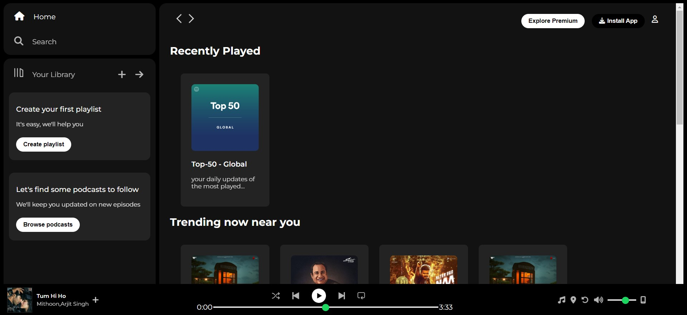

# Spotify-Home-Page-Clone
Welcome to my **Spotify Homepage Clone** project! This is my first major project built using **HTML** and **CSS**, where I aimed to replicate the homepage of the popular music streaming platform, Spotify.

In this project, I learned a lot about web development fundamentals, including page structure, layout techniques, responsive design, and the use of CSS properties to create a visually appealing user interface.

# Features
- Responsive Design: The layout adjusts to different screen sizes, making it user-friendly on desktop and mobile devices.
- Header and Navigation Bar: A simple, clean header with navigation links, mimicking Spotify’s design.
- Hero Section: A prominent section at the top showcasing background images and catchy text.
- Footer Section: An organized footer with links to various Spotify sections.

# Screenshots

# Future Improvements
- Adding more interactive elements using JavaScript (like a playlist carousel or search functionality).
- Improving accessibility features (ARIA labels, etc.).
- Enhancing the design with advanced CSS animations and transitions.

# Contributing
As this is a personal project, contributions are not open. However, I welcome feedback and suggestions for improvement! Feel free to raise an issue or create a pull request if you have any ideas.

#
Thank you for checking out my **Spotify Homepage Clone**! This project marks the beginning of my journey into web development, and I’m excited to keep building and improving my skills.
